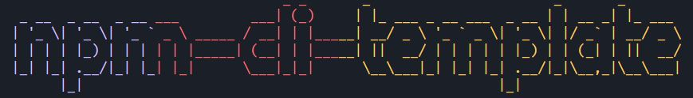
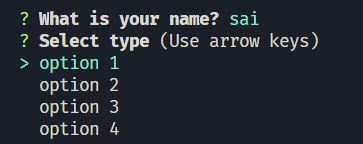

# Shabang

- tells to run file with node found on system

```
#!/usr/bin/env node
```

# chalk

- decorates text by adding background

```
chalk.bgGray("This is a template to create your own cli")
```

# chalk-animation

- animates text decoration of chalk like -> pulse, neon etc. 
```
const title = chalkAnimation.neon('Welcome to npm cli template \n')
await sleep()
title.stop()
```

# figlet

- adds text as shown below



```
const title = 'npm-cli-template'

figlet(title, (err,data) => {
    console.log(gradient.instagram.multiline(data))
})
```

# gradient-string

- adds decoration to text. 
- here its used with figlet

```
gradient.instagram.multiline(str)
```

# inquirer

- enables to enquire user of details



```
const answer = await inquirer.prompt({
    name: 'name',
    type: 'input',
    message: 'What is your name?',
    default() {
        return 'sankalp'
    }
})

const answer = await inquirer.prompt({
    name: 'type',
    type: 'list',
    message: 'Select type',
    choices: [
        'option 1',
        'option 2',
        'option 3',
        'option 4',
    ]
})
```

# nanospinner

- adds spinner

```
const spinner = createSpinner('Initialising...').start()
await sleep()
if (answer === 'option 3') {
    spinner.success({text: 'Success !!'})
} else {
    spinner.error({text: 'Error !!'})
}
process.exit(1)
```
